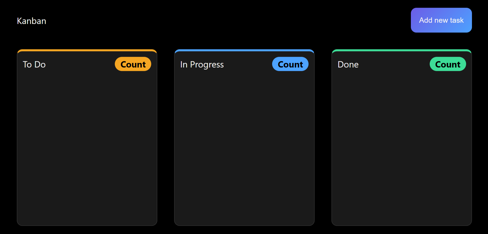
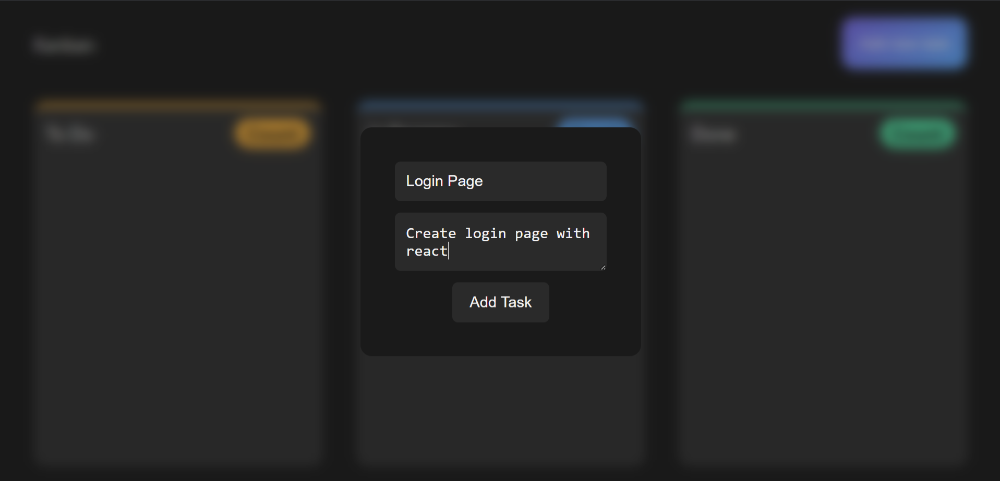
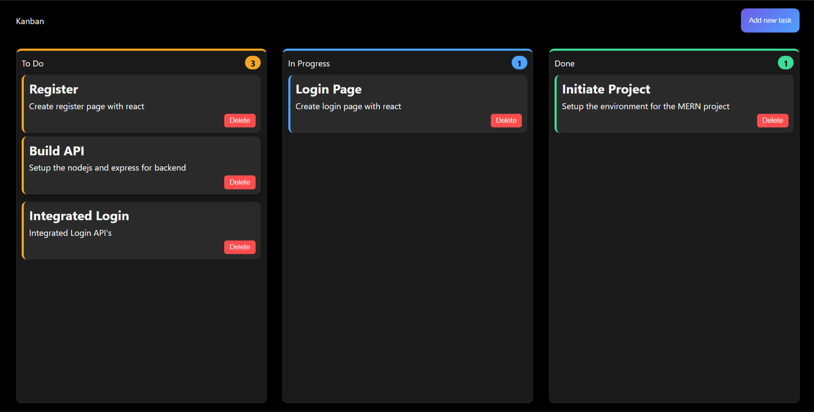

# 🗂️ Drag & Drop Kanban Board

**A minimal, dark-themed task board with native drag-and-drop.**

Organize tasks across **To Do**, **In Progress**, and **Done** columns — each with its own accent color — add tasks through a modal, drag them between columns, delete them, and everything persists across page reloads via `localStorage`. Built with pure HTML, CSS, and vanilla JavaScript — no frameworks, no libraries.

---

## 🚀 Live Demo

| Resource | Link |
|---|---|
| 🌐 Live Site | [Open Board](https://anantagarwal1307.github.io/Drag-Drop-Kanban-Board/index.html) |
| 📂 Repository | [GitHub Repo](https://github.com/anantagarwal1307/Drag-Drop-Kanban-Board) |

---

## 📸 Screenshots

| Empty Board | Add Task Modal |
|---|---|
|  |  |

| Populated Board |
|---|
|  |

---

## 🛠️ Built With

- **HTML5** — semantic structure, native **Drag and Drop API** (`draggable`, `dragenter`, `dragleave`, `dragover`, `drop`)
- **CSS3** — custom properties (design tokens) for colors, padding, and border radius; flexbox layout for columns
- **Vanilla JavaScript (ES6)** — DOM manipulation, event-driven drag logic, `localStorage` for persistence

---

## 📁 Project Structure

```
KANBAN/
├── index.html
├── style.css
└── script.js
```

---

## ✨ Features

- ➕ Add new tasks (title + description) through a modal popup
- 🖱️ Drag and drop tasks between To Do, In Progress, and Done
- 🗑️ Delete any task with one click
- 🔢 Live task count per column, updated automatically
- 💾 Full board state saved to `localStorage` — tasks persist after refresh
- 🎨 Color-coded columns (orange / blue / green accents) with matching task borders and pill-shaped count badges
- ✨ Hover lift effects on tasks and the Add Task button, gradient button styling

---

## 🧠 How It Works

- Each task is a `div.task` with `draggable="true"`, created dynamically and appended to a column.
- Dragging a task sets a `dragElement` reference; dropping it on a column appends that element into the new column and removes it from the old one automatically (since a DOM node can only exist in one place).
- After every add, delete, or drop, `updateTaskCount()` recalculates each column's task list and count, then serializes the whole board into `tasksData` and saves it to `localStorage`.
- On page load, if saved data exists in `localStorage`, it's parsed and used to rebuild every task in its correct column before the counts are updated.

---

## 🧠 What I Learned

- Using the native HTML5 Drag and Drop API (`dragenter`, `dragleave`, `dragover`, `drop`) without any external library
- Structuring application state as a plain object keyed by column ID, and keeping it in sync with the DOM
- Persisting and restoring complex UI state across sessions using `localStorage`
- Managing a reusable modal (open/close via class toggling) for data entry

---

## 🕹️ How to Use

1. Open `index.html` in any browser (or visit the live demo link above)
2. Click **Add new task**, fill in a title and description, then click **Add Task**
3. The task appears in the **To Do** column
4. Drag any task into **In Progress** or **Done** as it moves along
5. Click **Delete** on a task to remove it permanently
6. Refresh the page — your board stays exactly as you left it

---

## 👤 Author

**Anant Kumar Agarwal**
- GitHub: [@anantagarwal1307](https://github.com/anantagarwal1307)

---

## 📄 License

This project is licensed under the **MIT License** — see the [LICENSE](LICENSE) file for details.
